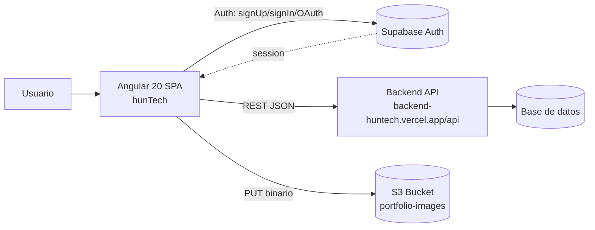

# Informe Funcional E2E — hunTech Frontend

- **Proyecto:** hunTech (Plataforma de inserción laboral IT — IFTS N°11)
- **Fecha:** 2026-05-22
- **Repositorio analizado:** `hunTech_FrontEnd/hunTech` (Angular 20, single-repo frontend)
- **Total de especificaciones:** 30 (5 Tier 1 + 10 Tier 2 + 15 Tier 3)

---

## 1. Resumen Ejecutivo

hunTech es una SPA en Angular 20 que conecta tres tipos de usuarios del ecosistema IFTS N°11:

- **Desarrolladores** (estudiantes / pasantes IT)
- **Gerentes** (empresas que publican proyectos y contratos)
- **Instituciones educativas**

La autenticación se delega en **Supabase Auth** (email/password + OAuth Google) y el dominio de negocio (usuarios, proyectos, contratos, portfolio, whitelist) se consume desde una **API REST externa** (`https://backend-huntech.vercel.app/api/`). Las imágenes de portfolio se suben directamente a un bucket **S3** público.

El acceso a las funcionalidades autenticadas está controlado por el `authGuard` (CanActivateFn) que valida la sesión Supabase en cada navegación.

## 2. Arquitectura Multi-Capa

### Módulos funcionales (frontend)

| Módulo | Path | Servicio principal | Endpoints/Recursos |
|---|---|---|---|
| Home (landing) | `componentes/home` | `AuthService` | - |
| Auth (login/registro) | en `navbar` (modal) | `AuthService` (Supabase) | `auth.signUp`, `auth.signInWithPassword`, `auth.signInWithOAuth('google')`, `auth.resetPasswordForEmail` |
| Perfil | `componentes/profile` | `Users`, `ProyectoService`, `ContratoService` | `GET usuario/{email}`, `GET usuario/{email}/{tabla}`, `PUT usuario/{email}`, `POST {rol}` |
| Portfolio | `componentes/portfolio-component` | `PortfolioService` | `GET portfolio/{email}`, `POST createportfolio/{email}`, `PUT {S3}/portfolios/{key}` |
| Mi Proyecto (gerente) | `componentes/miproyecto`, `views/formcreateproyect` | `ProyectoService` | `GET proyecto/{email}`, `POST proyecto`, `PUT proyecto/{email_gerente}` |
| Contratos (listado) | `componentes/contratos`, `componentes/contrato-detail` | `ContratoService` | `GET contratos`, `GET contratoslibres`, `GET contratos/{emailGerente}`, `PUT contrato/{id}` (postulación), `PUT contrato/asignar/{id}` |
| Crear Contrato (gerente) | `views/formcreatecontract` | `ContratoService` | `POST contrato`, `PUT contrato/{id}`, `DELETE contrato/{id}` |
| Whitelist Email | `componentes/whitelist-email` | `WhitelistEmailService` | `GET whitelist-email`, `POST whitelist-email`, `POST whitelist-email/upload` |
| Dashboard | `componentes/dashboard` | `Users`, `AuthService` | depende de `environment.gests` |
| Configuración | `componentes/configuracion` | `localStorage` | preferencias UI (tema, fontsize) |
| Alertas (toasts/modals) | `componentes/alertas` | `AlertService` | bus interno |
| Navbar + Libro 3D | `componentes/navbar` | `AuthService`, `Users` | navegación, logout, OAuth trigger |

### Roles detectados

`desarrollador` · `gerente` · `institucion_educativa` (configurables vía whitelist y `createUserByRole`).

### Rutas protegidas (todas con `authGuard`)

`/contratos`, `/profile`, `/profile/:email`, `/miproyecto`, `/formcreateproyect`, `/formcreateproyect/:email`, `/formcreatecontract`, `/formcreatecontract/:project_id`, `/dashboard`, `/whitelist-email`, `/configuracion`.

Rutas públicas: `/`, `/home`, `**` → redirect a `/`.

### Modelos de dominio relevantes

- **`Contrato`**: `id, tipo, titulo, descripcion, tiene_postulaciones, postulaciones[], esta_ocupado, pasante_email, proyecto_id, start_date, end_date, modalidad, seniority_deseado[]`
- **`Proyecto`**: `id, nombre, description, info_link, buscando_devs, contratos[], id_gerente, email_gerente`
- **`Portfolio`**: hasta 3 proyectos (titulo/descripcion/repositorio + 3 imágenes c/u)
- **`WhitelistEmail`**: `email, tipo_usuario, estado (activo|revocado|usado), observaciones, cargado_por, lote_id`

---

## 3. Clasificación por Criticidad

| Tier | Cantidad | Criterio |
|---|---|---|
| 🔴 Tier 1 | 5 | Crítico: bloquea negocio (login, alta perfil, alta proyecto, alta contrato, postulación) |
| 🟡 Tier 2 | 10 | Importante: flujos de alto uso (asignación, edición, listados, filtros, whitelist) |
| 🟢 Tier 3 | 15 | Complementario: features opcionales (UI, libro 3D, configuración, navegación) |

---

## 4. Especificaciones Tier 1 — Críticas (5)

### TEST-T1-001 — Login con email y contraseña (Supabase)

- **Descripción funcional:** Un usuario previamente registrado y presente en la whitelist puede autenticarse con email + password desde el modal de login del navbar y obtener una sesión Supabase activa que habilita el acceso a las rutas protegidas.
- **Actor:** desarrollador / gerente / institucion_educativa
- **Precondiciones:**
  - El email existe en `auth.users` de Supabase con password confirmada.
  - El email tiene un registro en la whitelist con `estado=activo` o `estado=usado`.
- **Flujo técnico:**
  1. Usuario abre modal de login en [navbar.ts](hunTech/src/app/componentes/navbar/navbar.ts).
  2. Frontend invoca `AuthService.signIn(email, password)` → `supabase.auth.signInWithPassword`.
  3. Supabase responde con `session` + `user`; `onAuthStateChange` emite el usuario en `currentUser$`.
  4. `Users.checkUserExists(email)` consulta `GET {apiUrl}usuario/{email}` para resolver la tabla/rol y luego `GET usuario/{email}/{tabla}`.
  5. `setUserProfile(data)` propaga el perfil; el navbar redirige a `/profile` si la URL actual es `/` o `/home`.
- **Contratos consumidos:**
  - Supabase: `POST {supabaseUrl}/auth/v1/token?grant_type=password`
  - Backend: `GET {apiUrl}usuario/{email}` → `{ data: { existe, tabla } }`
  - Backend: `GET {apiUrl}usuario/{email}/{tabla}` → datos completos del usuario
- **Validaciones funcionales:**
  - Credenciales inválidas → mensaje de error vía `AlertService.error`.
  - Si el email no existe en backend (404) → `Users` devuelve `{ existe: 0 }` (sin romper).
  - Sesión persistida en `localStorage` de Supabase; al refrescar se recupera vía `auth.getUser()`.
- **Datos sensibles:** password, JWT de Supabase, email.
- **Puntos de falla:**
  - Backend caído → perfil vacío pero sesión Supabase activa (estado inconsistente).
  - Whitelist no contempla el email → flujo funcional aceptable pero sin rol asignado.
- **Razón de criticidad:** Sin login, ninguna ruta protegida es accesible.

---

### TEST-T1-002 — Registro de usuario nuevo con email/password

- **Descripción funcional:** Un nuevo usuario crea su cuenta con email y password; Supabase envía email de confirmación. Tras la confirmación, el primer login dispara el alta del usuario en la tabla de rol correspondiente.
- **Actor:** visitante (cualquiera de los 3 roles)
- **Precondiciones:**
  - El email está cargado en la whitelist con `tipo_usuario` definido y `estado=activo`.
- **Flujo técnico:**
  1. Modal de registro en navbar → `AuthService.signUp(email, password)` → `supabase.auth.signUp`.
  2. Supabase crea el usuario y envía email de verificación (sin sesión todavía).
  3. Usuario confirma vía link; queda habilitado para `signIn`.
  4. En el primer login, `Users.checkUserExists` retorna `existe:0`; el flujo invoca `Users.createUserByRole(email, role)` → `POST {apiUrl}{role}` con `{ email }` (donde `role` debe venir de la whitelist).
- **Contratos consumidos:**
  - `POST {supabaseUrl}/auth/v1/signup`
  - `POST {apiUrl}desarrollador` | `gerente` | `institucion_educativa` con body `{ email }`
- **Validaciones funcionales:**
  - Email mal formado → error de Supabase.
  - Password no cumple política de Supabase → error.
  - Email duplicado en Supabase → error específico.
  - Email no whitelisted → el alta del rol no debería completarse (validación esperada del backend).
- **Datos sensibles:** password, email.
- **Razón de criticidad:** Sin alta de usuario no hay base instalada de la plataforma.

---

### TEST-T1-003 — Gerente crea su Proyecto (alta única por email)

- **Descripción funcional:** Un gerente autenticado que aún no tiene proyecto asociado puede crear su único proyecto desde el formulario, con nombre, descripción y link informativo. Tras la creación, el sistema entra en modo edición y redirige a `/miproyecto`.
- **Actor:** gerente
- **Precondiciones:** sesión activa con `rolActual === 'gerente'`; `GET proyecto/{email}` devuelve `data: []`.
- **Flujo técnico:**
  1. Navegación a `/formcreateproyect` (protegido por `authGuard`).
  2. [formcreateproyect.ts](hunTech/src/app/views/formcreateproyect/formcreateproyect.ts) suscribe a `userProfile$`, llama `ProyectoService.getProyectoPorEmail(email)`.
  3. Si `data.length === 0` → `espost=true`, `proyecto.email_gerente = perfil.email`.
  4. Submit → `ProyectoService.postProyecto(proyecto)` → `POST {apiUrl}proyecto`.
  5. Éxito → `router.navigate(['/miproyecto'])` + `alertService.success('Proyecto creado con éxito')`.
- **Contratos consumidos:**
  - `GET {apiUrl}proyecto/{email}` → `ProyectoResponse { count, data: Proyecto[] }`
  - `POST {apiUrl}proyecto` body: `{ nombre, description, info_link, buscando_devs:true, email_gerente }`
- **Validaciones funcionales:**
  - Form inválido (campos requeridos vacíos) → no envía.
  - `buscando_devs` por defecto `true`.
  - `email_gerente` se inyecta automáticamente.
- **Puntos de falla:**
  - Doble submit antes de redirección.
  - Backend acepta múltiples proyectos por email (no validado en frontend).
- **Razón de criticidad:** Sin proyecto, el gerente no puede crear contratos (los contratos requieren `proyecto_id`).

---

### TEST-T1-004 — Gerente crea Contrato/Oferta asociado a su proyecto

- **Descripción funcional:** El gerente crea una nueva oferta laboral (contrato) seleccionando tipo, modalidad, seniority deseado (múltiple) y fechas. El contrato queda con `esta_ocupado=false` disponible para postulaciones.
- **Actor:** gerente
- **Precondiciones:** sesión activa + proyecto existente (se pasa `project_id` por la ruta `/formcreatecontract/:project_id`).
- **Flujo técnico:**
  1. Navegación a `/formcreatecontract/:project_id` desde perfil → tab `ofertas`.
  2. [formcreatecontract.ts](hunTech/src/app/views/formcreatecontract/formcreatecontract.ts) inicializa `contrato.proyecto_id` desde la ruta.
  3. Usuario marca seniorities con `toggleSeniority()` (toggle multi-select).
  4. Si no se completa `start_date`, se asigna `new Date().toISOString().split('T')[0]`.
  5. Submit → `ContratoService.postContrato(contrato)` → `POST {apiUrl}contrato`.
  6. Éxito → `router.navigate(['/contratos'])` + alerta de éxito.
- **Contratos consumidos:**
  - `POST {apiUrl}contrato` body: `{ tipo, titulo, descripcion, esta_ocupado:false, pasante_email:"", proyecto_id, modalidad, seniority_deseado:[], start_date, end_date }`
- **Validaciones funcionales:**
  - Form invalid → no envía.
  - `seniority_deseado` debe poder seleccionarse múltiple (Trainee/Junior/Semisenior/Senior).
  - `modalidad` ∈ {remoto, presencial, hibrido}.
  - `start_date` ≤ `end_date` (no validado explícitamente — punto de falla).
- **Puntos de falla:** ausencia de validación start/end date; `proyecto_id` se lee del paramMap `'id'` pero la ruta define `:project_id` (potencial bug: ver línea 41 de formcreatecontract.ts).
- **Razón de criticidad:** Es la transacción de mayor valor de negocio para gerentes.

---

### TEST-T1-005 — Desarrollador se postula a un Contrato disponible

- **Descripción funcional:** Un desarrollador con sesión activa visualiza contratos no ocupados y se postula a uno. Su email se agrega a `postulaciones[]` del contrato y `tiene_postulaciones=true`.
- **Actor:** desarrollador
- **Precondiciones:** sesión activa, rol=desarrollador, existe al menos un contrato con `esta_ocupado=false` y el email del dev no está ya en `postulaciones`.
- **Flujo técnico:**
  1. Ingreso a `/contratos`. [contratos.ts](hunTech/src/app/componentes/contratos/contratos.ts) detecta rol y llama `ContratoService.getContratosLibres()` → `GET {apiUrl}contratoslibres`.
  2. Selecciona una card → se abre [contrato-detail.ts](hunTech/src/app/componentes/contrato-detail/contrato-detail.ts).
  3. Click "Postularme" → `ContratoService.postularseAContrato(id, email)` → `PUT {apiUrl}contrato/{id}` body `{ postulaciones: email }`.
  4. Encadena `updateContrato({ id, tiene_postulaciones:true })` → `PUT {apiUrl}contrato/{id}`.
  5. `AlertService.success('Postulación realizada con éxito')`.
- **Contratos consumidos:**
  - `GET {apiUrl}contratoslibres` → `ContratoResponse`
  - `PUT {apiUrl}contrato/{id}` (dos llamadas en cadena)
- **Validaciones funcionales:**
  - Toggle "Ver no postulados" filtra por `!postulaciones.includes(email)`.
  - Normalización defensiva: `postulaciones` puede venir como CSV string o array (`toArray`).
- **Puntos de falla:**
  - Doble click → doble postulación si el backend no es idempotente.
  - Las dos PUTs no son atómicas; falla de la segunda deja `tiene_postulaciones=false` aunque el email ya está.
- **Razón de criticidad:** Es el flujo central que justifica la existencia de la plataforma para los devs.

---

## 5. Especificaciones Tier 2 — Importantes (10)

### TEST-T2-001 — Gerente asigna un postulante a un contrato

- **Descripción:** Desde `contrato-detail`, gerente abre modal con lista `postulacionesNormalizadas`, selecciona un email y confirma asignación. El contrato queda `esta_ocupado=true`, `pasante_email=<email>`.
- **Flujo:** `ContratoService.asignarPostulante(idContrato, email)` → `PUT {apiUrl}contrato/asignar/{id}` body `{ pasante_email }`.
- **Validaciones:** alerta de éxito/error; emite `contratoAssigned` al padre.
- **Datos:** `id`, `pasante_email`.

### TEST-T2-002 — Edición de perfil (datos personales, habilidades, idiomas)

- **Descripción:** Usuario edita en `/profile` su teléfono, posición, habilidades (nombre+nivel) e idiomas; al guardar persiste vía `Users.updateUserByRole`.
- **Flujo:** mapeo back↔front (`nombre_habilidad`↔`nombre`, etc.) en [profile.component.ts](hunTech/src/app/componentes/profile/profile.component.ts); `PUT {apiUrl}usuario/{email}`.
- **Validaciones:** rol y email obligatorios (throw `Error("No se puede actualizar sin rol o email")`); actualización optimista del store local vía `setUserProfile`.

### TEST-T2-003 — Edición del Proyecto del gerente

- **Descripción:** Si el gerente ya tiene proyecto (`getProyectoPorEmail` devuelve data), entra en `esedit=true` y puede modificar nombre/descripción/info_link/buscando_devs.
- **Flujo:** `ProyectoService.editProyecto(proyecto)` → `PUT {apiUrl}proyecto/{email_gerente}`.
- **Validaciones:** form inválido bloquea submit; toggle `buscando_devs`.

### TEST-T2-004 — Listado y filtros de contratos (modalidad, seniority, búsqueda por título)

- **Descripción:** En `/contratos`, el dev/gerente puede filtrar por `modalidad`, `seniority_deseado` y buscar por título. La función `filtrarContratos()` reduce sobre `todosLosContratos`.
- **Validaciones:** `limpiarFiltros()` resetea filtros; búsqueda lowercased; filtros combinables; `toggleContratosDisponiblesNoPostulados` excluye los ya postulados.

### TEST-T2-005 — Crear/Editar Portfolio del desarrollador (hasta 3 proyectos)

- **Descripción:** El desarrollador completa título/descripción/repo y sube hasta 3 imágenes por proyecto. Las imágenes se suben primero a S3 vía `PUT {bucketUrl}/portfolios/{ts}_{filename}`, y luego se envía el payload normalizado a `POST {apiUrl}createportfolio/{email}`.
- **Validaciones:** "El primer proyecto debe tener un título" (warning); máximo 3 archivos por proyecto; arrays de imágenes normalizados a longitud 3.
- **Datos sensibles:** URLs públicas S3.

### TEST-T2-006 — Visualización de perfil ajeno (gerente ve perfil de postulante)

- **Descripción:** Desde `contrato-detail`, gerente hace click "Ver perfil postulante" → `router.navigate(['/profile', email])`. El perfil resuelve si el email es propio o ajeno; si es ajeno, consulta `checkUserExists` + `getUsuarioByEmailAndTable` y muestra modo solo-lectura (`isOwnProfile=false`).
- **Validaciones:** si `existe===0` → `AlertService.error('Usuario no encontrado')` + redirect a `/`.

### TEST-T2-007 — Listado de contratos del gerente (filtrado por email_gerente)

- **Descripción:** Para `rolActual==='gerente'`, `mostrarTodosLosContratos()` invoca `getContratosByEmailGerente(email)` → `GET {apiUrl}contratos/{emailGerente}`. Se segregan en `contratosDisponibles`, `contratosAsignados`, `contratosPendientes`.
- **Validaciones:** segregación correcta por `esta_ocupado`, `pasante_email`, `postulaciones`.

### TEST-T2-008 — Whitelist: alta individual de email autorizado

- **Descripción:** Admin agrega un email a la whitelist vía `WhitelistEmail` componente con `tipo_usuario` y observaciones opcionales.
- **Flujo:** `WhitelistEmailService.create(dto)` → `POST {apiUrl}whitelist-email`. Si la respuesta trae `warning` (ya existía) → toast warning; sino toast success. Refresca lista.
- **Validaciones:** email y tipo_usuario obligatorios; `cargado_por` se completa con el email del usuario logueado.

### TEST-T2-009 — Whitelist: carga masiva por CSV

- **Descripción:** Admin sube un archivo `.csv` con emails; el backend responde con `{ success, warnings, errores }` desglosado.
- **Flujo:** `WhitelistEmailService.uploadCsv(file, cargadoPor)` → `POST {apiUrl}whitelist-email/upload` multipart.
- **Validaciones:** extensión `.csv` obligatoria (regex `/\.csv$/i`); muestra resumen por fila con motivo de error.

### TEST-T2-010 — Logout y limpieza de sesión

- **Descripción:** Usuario hace logout desde navbar → `AuthService.signOut()` → `supabase.auth.signOut()`. `currentUser$` emite `null`, las rutas protegidas dejan de ser accesibles (próxima navegación → `authGuard` redirige a `/`).
- **Validaciones:** `userProfile$` también debería limpiarse para evitar fugas de perfil; al volver a entrar en rutas protegidas, `authGuard` redirige a la home.

---

## 6. Especificaciones Tier 3 — Complementarias (15)

### TEST-T3-001 — Login social con Google (OAuth)

- **Descripción:** `AuthService.signInWithSocial('google')` → `supabase.auth.signInWithOAuth({ provider:'google', options:{ redirectTo: window.location.origin } })`. Tras el callback de OAuth, la sesión queda activa.
- **Validaciones:** mismo flujo post-login que TEST-T1-001 (resolución de rol). Funcional solo si OAuth Google está configurado en el proyecto Supabase.

### TEST-T3-002 — Reset de password vía email

- **Descripción:** `AuthService.resetPassword(email)` → `supabase.auth.resetPasswordForEmail(email, { redirectTo: /reset-password })`. Envía mail con magic link.
- **Validaciones:** la ruta `/reset-password` no está definida en `app.routes.ts` → al volver del link redirige al `**` (home). **Punto de mejora.**

### TEST-T3-003 — AuthGuard bloquea acceso sin sesión

- **Descripción:** Visitante sin sesión intenta acceder a `/contratos` (o cualquier protegida) → [authGuard](hunTech/src/app/servicios/guards/authGuard.ts) verifica `authService.session` y, si no hay sesión, devuelve `UrlTree(['/'])`.
- **Validaciones:** redirección a `/` sin mostrar la vista; logueo de error en consola si `getSession` falla.

### TEST-T3-004 — Redirección automática a `/profile` tras login

- **Descripción:** Cuando el navbar detecta un nuevo `user$` y la URL es `/` o `/home`, navega a `/profile` automáticamente.
- **Validaciones:** no debe redirigir si el usuario ya estaba en otra ruta.

### TEST-T3-005 — Catch-all wildcard redirige rutas inexistentes a home

- **Descripción:** Ruta `**` → `redirectTo: ''`. Cualquier URL no mapeada termina en home.
- **Validaciones:** funciona para usuarios autenticados y anónimos por igual.

### TEST-T3-006 — Configuración: cambio de tema oscuro/claro persistido

- **Descripción:** [configuracion.ts](hunTech/src/app/componentes/configuracion/configuracion.ts) toggle dark mode → guarda `theme` en `localStorage` y aplica clase `dark-theme` al `body`. Persiste entre sesiones.
- **Validaciones:** valor inicial leído de `localStorage`. El navbar también lee/aplica este flag (`isModoOscuro`).

### TEST-T3-007 — Configuración: cambio de tamaño de fuente (small/normal/large)

- **Descripción:** Selección de tamaño → guarda `fontSizePreference` y aplica clase `font-{size}` a `body` y `documentElement`.
- **Validaciones:** sólo acepta `small | normal | large`; persistencia en `localStorage`.

### TEST-T3-008 — Navbar: libro 3D informativo (modal "Quiénes somos")

- **Descripción:** Toggle `showBookModal` abre un modal con `bookSpreads` paginables (8 páginas con contenido institucional). Navegación con `bookNext()`/`bookPrev()`.
- **Validaciones:** índice no rebasa límites; cerrar modal preserva `bookSpread` para próxima apertura.

### TEST-T3-009 — Navegación por fragments hacia secciones de contratos

- **Descripción:** Click en links del menú → `navigateToFragment('asignados'|'pendientes'|'disponibles')` navega a `/contratos#fragment` y hace scroll suave.
- **Validaciones:** `activeFragment` se actualiza al `NavigationEnd`; scroll diferido 120ms.

### TEST-T3-010 — Selección de contrato vía queryParam `?id=<n>`

- **Descripción:** Al entrar a `/contratos?id=42`, `Contratos.ngOnInit` lee `pendingSelectContratoId` y abre el detalle correspondiente cuando termina de cargar la lista.
- **Validaciones:** id numérico (`!isNaN`); ignora si no se encuentra.

### TEST-T3-011 — Eliminar contrato (DELETE)

- **Descripción:** `ContratoService.deleteContrato(id)` → `DELETE {apiUrl}contrato/{id}`. Disponible desde la UI del gerente (ofertas).
- **Validaciones:** confirmar acción antes de eliminar (modal `AlertService` tipo `confirm`); refrescar listado tras OK.

### TEST-T3-012 — Whitelist: filtros por estado / tipo_usuario / búsqueda libre

- **Descripción:** El componente `WhitelistEmail` permite filtrar por `estado` (activo/revocado/usado), `tipo_usuario` y texto libre (`q` con debounce de 350ms).
- **Validaciones:** debounce; reset a `page=1` al cambiar filtros; botón "Limpiar filtros".

### TEST-T3-013 — Whitelist: paginación del listado

- **Descripción:** `irPagina(p)` valida `1 ≤ p ≤ totalPages`; `totalPages = ceil(total / pageSize)` con `pageSize=20`.
- **Validaciones:** ignora click fuera de rango o sobre la página actual.

### TEST-T3-014 — Dashboard restringido a usuarios `gests`

- **Descripción:** [dashboard.ts](hunTech/src/app/componentes/dashboard/dashboard.ts) marca `auth=true` solo si `environment.gests.includes(perfil.email)`. Vista para usuarios autorizados (lista vacía por defecto en environment).
- **Validaciones:** sin email en `gests` → `auth=false` (no muestra contenido administrativo).

### TEST-T3-015 — Sistema de alertas globales (toasts + confirm modal)

- **Descripción:** [Alertas](hunTech/src/app/componentes/alertas/alertas.ts) suscribe a `AlertService.alert$` y renderiza toasts (`success|warning|error|info`) con auto-dismiss configurable (`timeout`, default 3500ms) o un modal `confirm` exclusivo que resuelve una promesa boolean.
- **Validaciones:** los `confirm` reemplazan toda la cola; los toasts no-confirm se acumulan; `accept()`/`cancel()` resuelven el promise.

---

## 7. Mapa de Trazabilidad (Especificación → Archivos clave)

| Spec | Archivos principales |
|---|---|
| T1-001 | [AuthService.ts](hunTech/src/app/servicios/AuthService.ts), [navbar.ts](hunTech/src/app/componentes/navbar/navbar.ts), [users.ts](hunTech/src/app/servicios/users.ts) |
| T1-002 | [AuthService.ts](hunTech/src/app/servicios/AuthService.ts), [users.ts](hunTech/src/app/servicios/users.ts) |
| T1-003 | [formcreateproyect.ts](hunTech/src/app/views/formcreateproyect/formcreateproyect.ts), [miproyecto.ts](hunTech/src/app/servicios/miproyecto.ts) |
| T1-004 | [formcreatecontract.ts](hunTech/src/app/views/formcreatecontract/formcreatecontract.ts), [contrato.ts](hunTech/src/app/servicios/contrato.ts) |
| T1-005 | [contratos.ts](hunTech/src/app/componentes/contratos/contratos.ts), [contrato-detail.ts](hunTech/src/app/componentes/contrato-detail/contrato-detail.ts) |
| T2-001 | [contrato-detail.ts](hunTech/src/app/componentes/contrato-detail/contrato-detail.ts) |
| T2-002 | [profile.component.ts](hunTech/src/app/componentes/profile/profile.component.ts), [users.ts](hunTech/src/app/servicios/users.ts) |
| T2-003 | [formcreateproyect.ts](hunTech/src/app/views/formcreateproyect/formcreateproyect.ts) |
| T2-004 | [contratos.ts](hunTech/src/app/componentes/contratos/contratos.ts) |
| T2-005 | [portfolio-component.ts](hunTech/src/app/componentes/portfolio-component/portfolio-component.ts), [portfolioService.ts](hunTech/src/app/servicios/portfolioService.ts) |
| T2-006 | [profile.component.ts](hunTech/src/app/componentes/profile/profile.component.ts), [contrato-detail.ts](hunTech/src/app/componentes/contrato-detail/contrato-detail.ts) |
| T2-007 | [contratos.ts](hunTech/src/app/componentes/contratos/contratos.ts), [contrato.ts](hunTech/src/app/servicios/contrato.ts) |
| T2-008 | [whitelist-email.ts (cmp)](hunTech/src/app/componentes/whitelist-email/whitelist-email.ts), [whitelist-email.ts (svc)](hunTech/src/app/servicios/whitelist-email.ts) |
| T2-009 | [whitelist-email.ts (cmp)](hunTech/src/app/componentes/whitelist-email/whitelist-email.ts) |
| T2-010 | [AuthService.ts](hunTech/src/app/servicios/AuthService.ts), [navbar.ts](hunTech/src/app/componentes/navbar/navbar.ts) |
| T3-001 | [AuthService.ts](hunTech/src/app/servicios/AuthService.ts) |
| T3-002 | [AuthService.ts](hunTech/src/app/servicios/AuthService.ts) |
| T3-003 | [authGuard.ts](hunTech/src/app/servicios/guards/authGuard.ts) |
| T3-004 | [navbar.ts](hunTech/src/app/componentes/navbar/navbar.ts) |
| T3-005 | [app.routes.ts](hunTech/src/app/app.routes.ts) |
| T3-006 | [configuracion.ts](hunTech/src/app/componentes/configuracion/configuracion.ts) |
| T3-007 | [configuracion.ts](hunTech/src/app/componentes/configuracion/configuracion.ts) |
| T3-008 | [navbar.ts](hunTech/src/app/componentes/navbar/navbar.ts) |
| T3-009 | [navbar.ts](hunTech/src/app/componentes/navbar/navbar.ts) |
| T3-010 | [contratos.ts](hunTech/src/app/componentes/contratos/contratos.ts) |
| T3-011 | [contrato.ts](hunTech/src/app/servicios/contrato.ts) |
| T3-012 | [whitelist-email.ts (cmp)](hunTech/src/app/componentes/whitelist-email/whitelist-email.ts) |
| T3-013 | [whitelist-email.ts (cmp)](hunTech/src/app/componentes/whitelist-email/whitelist-email.ts) |
| T3-014 | [dashboard.ts](hunTech/src/app/componentes/dashboard/dashboard.ts) |
| T3-015 | [alertas.ts](hunTech/src/app/componentes/alertas/alertas.ts) |

---

## 8. Riesgos y observaciones detectadas durante el análisis

- **Inconsistencia de routing en crear contrato:** la ruta declara `:project_id` pero el componente lee `paramMap.get('id')` (ver TEST-T1-004) → potencial bug que dejaría `proyecto_id` en `null!`.
- **No-atomicidad en postulación:** dos PUTs encadenadas (TEST-T1-005) pueden dejar estado inconsistente.
- **Ruta `/reset-password` no definida:** el redirect del email de Supabase cae en el wildcard (TEST-T3-002).
- **Whitelist usa `environment.prod`** en `servicios/whitelist-email.ts` aun en desarrollo (mezcla de entornos).
- **`environment.gests` vacío** en environment.ts: la pantalla Dashboard nunca se desbloquea por defecto.
- **Credenciales/URLs expuestas** en `environment.ts` (Supabase publishable key + bucket URL): aceptable solo si las keys son anónimas/públicas.
